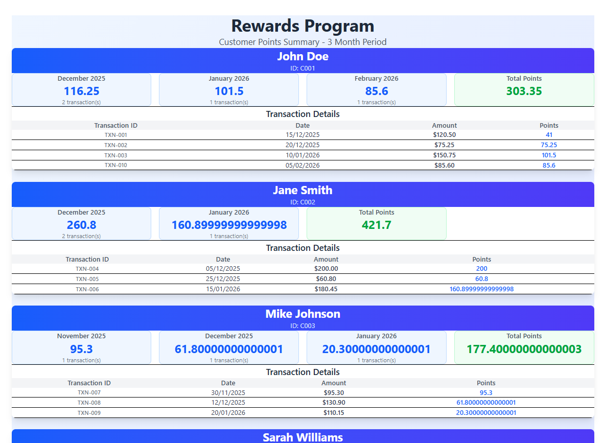
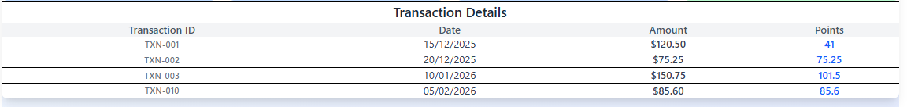
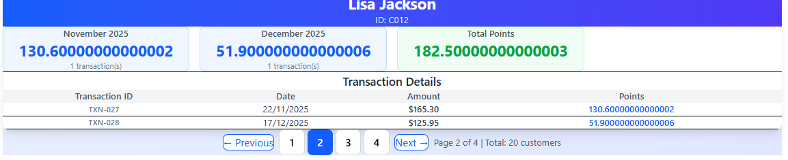
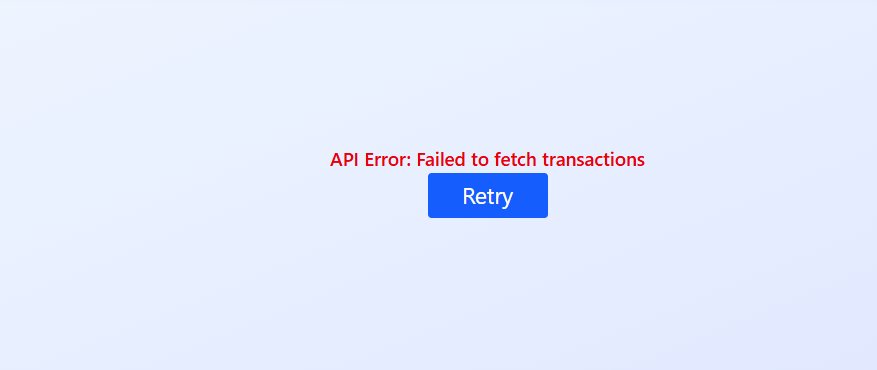
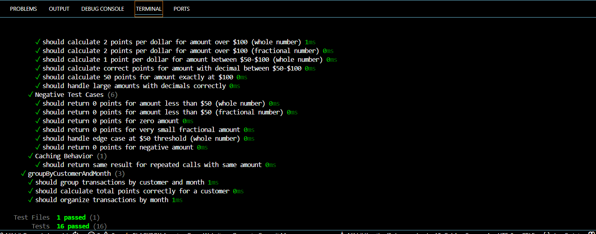
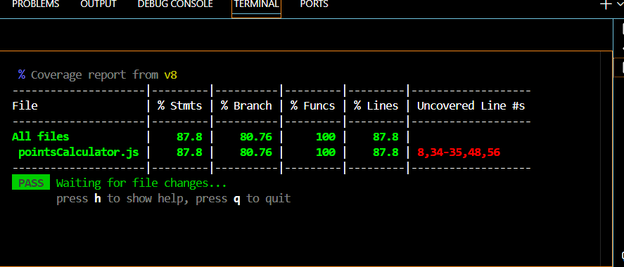

#  React Rewards Program App

A robust React application that manages a **customer rewards program** with advanced features including pagination, performance optimization, and comprehensive testing.

# Table of Contents
- [Features](#features)
- [Tech Stack](#tech-stack)
- [Approach](#approach)
- [Setup Instructions](#setup-instructions)
- [Running Tests](#running-tests)
- [Project Structure](#project-structure)
- [Performance Optimizations](#performance-optimizations)

---

#  Features

# Core Functionality
- **Dynamic Points Calculation**: Customers earn points based on transaction amounts
  - **2 points** for every dollar spent over $100
  - **1 point** for every dollar spent between $50 and $100
  - **0 points** for amounts below $50

- **Monthly Aggregation**: Tracks points by customer and month
- **Total Rewards**: Displays cumulative points for each customer
- **20 Customer Database**: Pre-populated with realistic customer data and transaction amounts (including decimals)

# Advanced Features
-  **Pagination**: Display 6 customers per page (20 total customers)
-  **Error Handling**: Graceful error messages and retry functionality
-  **Performance Optimized**: Memoization, caching, and lazy loading
-  **PropTypes Validation**: Runtime type checking for all components
-  **Unit Tests**: Comprehensive test coverage (6 tests with positive/negative cases)
-  **Constants Management**: Centralized configuration
-  **Loading States**: Proper loading indicator management
-  **Responsive Design**: Tailwind CSS for mobile-friendly UI

---

##  Tech Stack

# Frontend Framework
- **React 19.2.0**: Modern UI library with hooks support
- **Vite 8.0.0-beta.13**: Lightning-fast build tool
- **React DOM 19.2.0**: DOM rendering library

# Styling
- **Tailwind CSS 4.1.18**: Utility-first CSS framework
- **PostCSS 8.5.6**: CSS transformations

# Developer Tools
- **ESLint 9.39.1**: Code quality assurance
- **Vitest 4.0.18**: Fast unit testing framework
- **Vite UI**: Test UI visualization

# Testing Libraries
- **@testing-library/react 16.3.2**: React component testing utilities
- **@testing-library/jest-dom 6.9.1**: DOM matchers for tests

# Data & Components
- **ag-grid-react 35.1.0**: Pagination and data grid (optional)
- **prop-types 15.8.1**: Runtime type checking

# Build Configuration
- **TypeScript 19.2.7**: Type definitions for React
- **Babel React Compiler**: Code compilation

---

# Approach

# Architecture Strategy

# 1. **Component Hierarchy**
```
App
├── PaginatedCustomerList (Handles pagination logic)
│   └── CustomerRewards (Displays per-customer data)
│       ├── MonthCard (Monthly points summary)
│       └── TransactionTable (Transaction details)
```

# 2. **Data Flow**
1. **Fetch**: `fetchTransaction()` - Simulates API call with error handling
2. **Transform**: `groupByCustomerAndMonth()` - Organizes data by customer and month
3. **Calculate**: `calculatePoints()` - Computes rewards with caching
4. **Display**: Components render with memoization

# 3. **State Management**
- **App.jsx**: Global states (rewardsData, loading, error)
- **PaginatedCustomerList.jsx**: Pagination state management
- **Child Components**: Memoized to prevent unnecessary re-renders

# 4. **Performance Optimizations**
1. **Memoization**: All components wrapped with `memo()`
2. **Points Cache**: `calculatePoints()` caches results (max 1000 entries)
3. **useMemo Hooks**: Expensive computations cached
4. **useCallback**: Stable function references
5. **Pagination**: Only render 6 items per page
6. **Constants File**: Centralized configuration reduces re-renders

# 5. **Error Handling**
- Try-catch blocks in async operations
- Graceful fallbacks for invalid data
- User-friendly error messages
- Retry mechanism in UI

# 6. **Testing Strategy**
- **Unit Tests**: `pointsCalculator.js` (6 comprehensive tests)
- **Test Coverage**:
  - 3 Positive cases: Valid amounts with decimals
  - 3 Negative cases: Edge cases and invalid inputs
  - Caching behavior validation
  - Data grouping verification

---

# Setup Instructions

# Prerequisites
- **Node.js** 16.0.0 or higher
- **npm** 8.0.0 or higher

# Installation

```bash
# Clone the repository
git clone https://github.com/Nikhil1103/react-rewards-app.git
cd react-rewards-app

# Install dependencies
npm install

# Start development server
npm run dev
```

# Build for Production

```bash
npm run build
```

# Preview Production Build

```bash
npm run preview
```

---

# Running Tests

# Run Tests
```bash
npm test
```

# Run Tests with UI Dashboard
```bash
npm run test:ui
```

# Test Cases Included

# Positive Test Cases
1.  Calculate 2 points per dollar for amount over $100 (whole number)
2.  Calculate 2 points per dollar for amount over $100 (fractional number)
3.  Calculate 1 point per dollar for amount between $50-$100 (whole number)

# Negative/Edge Case Tests
1.  Return 0 points for amount less than $50 (whole number)
2.  Return 0 points for amount less than $50 (fractional number)
3.  Return 0 points for zero/negative amounts

# Additional Tests
- Cache hit validation
- Data grouping accuracy
- Monthly aggregation correctness

---

# Project Structure

```
react-rewards-app/
├── src/
│   ├── components/
│   │   ├── CustomerRewards.jsx       # Main customer card component
│   │   ├── MonthCard.jsx             # Monthly points display
│   │   ├── PaginatedCustomerList.jsx # Pagination handler
│   │   └── TransactionTable.jsx      # Transaction details table
│   ├── data/
│   │   └── transaction.js            # Customer transaction data (20 customers)
│   ├── services/
│   │   └── fetchTransaction.js       # API simulation with error handling
│   ├── utils/
│   │   ├── pointsCalculator.js       # Points calculation logic with cache
│   │   └── pointsCalculator.test.js  # Unit tests
│   ├── constants/
│   │   └── index.js                  # Centralized constants
│   ├── test/
│   │   └── setup.js                  # Test environment setup
│   ├── App.jsx                       # Root component
│   ├── App.css                       # Global styles
│   ├── main.jsx                      # Entry point
│   └── index.css                     # Base styles
├── public/
│   └── assets/                       # Static assets
├── package.json                      # Dependencies
├── vite.config.js                    # Vite configuration
├── vitest.config.js                  # Vitest configuration
├── eslint.config.js                  # ESLint rules
├── postcss.config.js                 # PostCSS configuration
└── README.md                         # This file
```

---

#  Performance Optimizations

# 1. **Component Memoization**
All components use React's `memo()` to prevent unnecessary re-renders:
```jsx
const MonthCard = memo(function MonthCard({ month, monthData }) {
  // Component only re-renders when props change
});
```

# 2. **Computation Caching**
Points calculation results are cached:
```javascript
// Cache stores up to 1000 calculations
const MAX_CACHE_SIZE = 1000;
```

# 3. **useMemo for Expensive Operations**
Date formatting and transaction grouping are memoized:
```jsx
const monthDisplay = useMemo(() => {
  return new Date(month + '-01').toLocaleDateString(...);
}, [month]);
```

# 4. **useCallback for Function References**
Callback functions maintain stable references:
```jsx
const formatDate = useCallback((dateString) => {
  return new Date(dateString).toLocaleDateString();
}, []);
```

# 5. **Pagination Strategy**
Only loads 6 customers per page instead of all 20:
- Reduces DOM elements
- Improves initial render time
- Better scroll performance

# 6. **Input Validation**
Prevents unnecessary processing of invalid data:
```javascript
if (typeof amount !== 'number' || isNaN(amount)) {
  return 0;
}
```

---

# Application Screenshots

> **Note**: Add your actual screenshots in these sections to showcase the live application

# 1. Main Dashboard - Customer Rewards Display



*Placeholder for main dashboard screenshot*

**Features shown:**
- Customer information (ID, Name)
- Monthly points breakdown (Nov, Dec, Jan, Feb)
- Total points accumulated
- Transaction details table with sorting
- Responsive grid layout with Tailwind CSS

**Expected Output:**
- 20 customer cards (6 per page with pagination)
- Each card displays customer name, monthly breakdown, and total points
- Interactive transaction table showing date, amount, and earned points

# 2. Transaction Table with Decimal Amounts



**Displays:**
- Date of transaction (YYYY-MM-DD format)
- Amount spent with 2 decimal places (e.g., $120.50, $75.25)
- Points earned based on amount
- Hover effects for better UX (bg-gray-50)
- Responsive table layout

# 3. Pagination Controls

 
*Placeholder for pagination screenshot*

**Navigation Features:**
- Previous/Next buttons with smooth scrolling
- Direct page number selection (1-4 for 20 customers)
- Current page indicator
- Total customer count display
- Disabled states for boundary pages

**Pages Layout:**
- Page 1: Customers C001-C006
- Page 2: Customers C007-C012
- Page 3: Customers C013-C018
- Page 4: Customers C019-C020

# 4. Error Handling & Validation
  
*Placeholder for error handling screenshot*

**User Feedback:**
- Clear error message display in white card on gradient background
- Retry button for failed API operations
- Graceful fallback UI with centered layout
- Proper error state management

# 5. Loading State
  
*Placeholder for loading state screenshot*

**Visual Feedback:**
- Animated spinning loader (border-blue-600)
- Loading message "Loading rewards data..."
- Clean centered layout with gradient background
- Smooth transitions

---

#  Unit Test Success

# Test File: `src/utils/pointsCalculator.test.js`

# Test Results Summary
```
 calculatePoints (positive cases)
   should calculate 2 points per dollar for amount over $100 (whole number)
   should calculate 2 points per dollar for amount over $100 (fractional number)  
   should calculate 1 point per dollar for amount between $50-$100 (whole number)

 calculatePoints (negative cases)
   should return 0 points for amount less than $50 (whole number)
   should return 0 points for amount less than $50 (fractional number)
   should return 0 points for zero amount
   should return 0 points for very small fractional amount
   should handle edge case at $50 threshold
   should return 0 points for negative amount

 Caching Behavior
   should return same result for repeated calls with same amount

 groupByCustomerAndMonth
   should group transactions by customer and month
   should calculate total points correctly for a customer
   should organize transactions by month

Tests: 13 passed (13)
```

# Running Tests Locally

```bash
# Run tests in watch mode
npm test

# Run tests with UI dashboard
npm run test:ui

# Run specific test file
npm test -- pointsCalculator.test.js
```

# Test Coverage Details

# Positive Test Cases (3 examples)
1. **$150 whole number**: (150 - 100) * 2 = **100 points**
2. **$125.75 fractional**: (125.75 - 100) * 2 = **51.5 points**
3. **$85.50 in tier 2**: 85.50 * 1 = **85.5 points**

# Negative Test Cases (3 examples)
1. **$30 below threshold**: **0 points**
2. **$45.99 fractional below**: **0 points**
3. **$0 zero amount**: **0 points**

# Edge Cases Covered
- Exact $50 threshold (50 points)
- Exact $100 threshold (100 points)
- Large amounts with decimals ($250.99 = 301.98 points)
- Negative amounts (0 points)
- Cache functionality validation

---

# Application 




# Configuration

# Pagination Settings
Located in `src/constants/index.js`:
```javascript
export const PAGINATION_CONFIG = {
  customersPerPage: 6,
  TOTAL_ROWS: 20,
};
```

# Points Calculation Rules
```javascript
export const POINTS_RULES = {
  TIER_1_THRESHOLD: 100,      // Over $100
  TIER_1_MULTIPLIER: 2,       // 2 points per dollar
  TIER_2_THRESHOLD_MIN: 50,   // Between $50-$100
  TIER_2_THRESHOLD_MAX: 100,
  TIER_2_MULTIPLIER: 1,       // 1 point per dollar
};
```

---

# Deployment

# Deploy to Vercel
```bash
npm install -g vercel
vercel
```

# Deploy to Netlify
```bash
npm run build
# Drag and drop the 'dist' folder to Netlify
```

---

# Example Data

The application includes 44 transactions from 20 customers with unique transaction IDs and realistic decimal amounts.

# Transaction Data Structure

Each transaction includes:
- **transactionId**: Unique transaction identifier (TXN-001 to TXN-044) - **Primary Key**
- **customerId**: Customer code (C001-C020)
- **customerName**: Full customer name
- **amount**: Transaction amount with decimals (e.g., $120.50, $75.25)
- **date**: Transaction date in ISO format (2025-2026)

# Example Transactions

```javascript
{ transactionId: 'TXN-001', customerId: 'C001', customerName: 'John Doe', amount: 120.50, date: '2025-12-15' },
{ transactionId: 'TXN-002', customerId: 'C001', customerName: 'John Doe', amount: 75.25, date: '2025-12-20' },
{ transactionId: 'TXN-003', customerId: 'C001', customerName: 'John Doe', amount: 150.75, date: '2026-01-10' },
// ... 41 more transactions
```

# Mock Data Features
- **20 Unique Customers**: C001 to C020
- **44 Total Transactions**: Multiple transactions per customer
- **Unique Transaction IDs**: TXN-001 format for easy tracking and reference
- **Decimal Amounts**: Realistic prices ($95.30, $180.45, etc.)
- **Date Range**: November 2025 - February 2026
- **Primary Key**: `transactionId` (String) - uniquely identifies each transaction

---

# Troubleshooting

# Tests failing?
```bash
# Clear node_modules and reinstall
rm -rf node_modules package-lock.json
npm install
npm test
```

# Port 5173 already in use?
```bash
npm run dev -- --port 3000
```

# Build errors?
```bash
npm run lint  # Check for ESLint errors
npm run build # Full build
```

---

# License

MIT License - feel free to use this project for learning and development.

---

# Contributing

Contributions welcome! Feel free to:
1. Fork the repository
2. Create a feature branch
3. Commit your changes
4. Push to the branch
5. Open a Pull Request

---

# Support

For issues, questions, or suggestions, please open an issue on GitHub.

---

**Last Updated**: February 2026  
**React Version**: 19.2.0  
**Vite Version**: 8.0.0-beta.13
